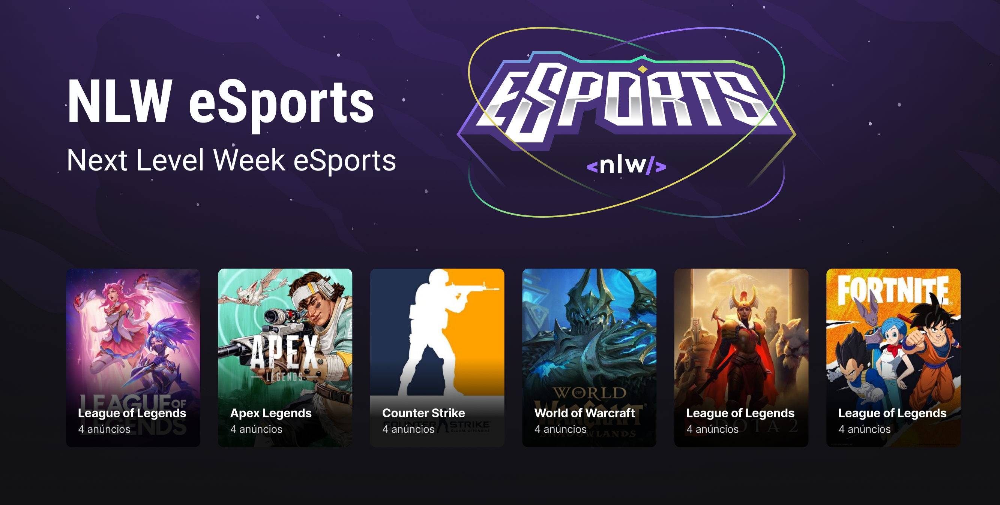

<p align="center">
  

  
 
  <a href="https://github.com/bfukumori/find-your-duo/commits/master">
    
  </a>
    
   
   <a href="https://github.com/bfukumori/find-your-duo/stargazers">
    
  </a>

  <a href="">
    
  </a>
</p>

<div align="center">
	
</div>

<p align="center">
  <a href="#about">About</a> •
  <a href="#features">Features</a> •
  <a href="#how-it-works">How it works</a> • 
  <a href="#tech-stack">Tech Stack</a> • 
  <a href="#author">Author</a> • 
  <a href="#user-content-license">License</a>
</p>

<div align="center"> 
	
</div>

## About

🎮 Find your duo - Find a partner to play your favorite games with you!


---

## Next Features

- [ ] Add React Hook Form
- [ ] Validation
- [ ] Handling Errors (back and front)
- [ ] Images Carrousel with Keen Slider
- [ ] Twitch API integration
- [ ] Game page - web version
- [ ] Authentication
- [ ] Backend notifications

---

## How it works

### Pre-requisites

Before you begin, you will need to have the following tools installed on your machine:
[Git](https://git-scm.com), [Node.js](https://nodejs.org/en/)
In addition, it is good to have an editor to work with the code like [VSCode](https://code.visualstudio.com/) and Expo Go app installed in your phone or an emulator like [Android Studio](https://react-native.rocketseat.dev/).


#### Running the server (backend)

```bash

# Clone this repository
$ git clone git@github.com:bfukumori/find-your-duo.git

# Access the project folder in your terminal
$ cd find-your-duo

# Install the dependencies
$ cd server
$ npm install

# Create your own env variables

# Run the server
$ npm run dev
# Server will run in http://localhost:3333

```

#### Running the application (frontend)

```bash

# Clone this repository
$ git clone git@github.com:bfukumori/find-your-duo.git

# Access the project folder in your terminal
$ cd find-your-duo

# Install the dependencies
$ cd web
$ npm install

# Create your own env variables

# The application will open on the port: 5173 - go to http://localhost:5173


```

#### Running the mobile app

```bash

# Clone this repository
$ git clone git@github.com:bfukumori/find-your-duo.git

# Access the project folder in your terminal
$ cd find-your-duo

# Install the dependencies
$ cd mobile
$ npm install

# Install the expo cli
$ npm install -g expo-cli

# Create your own env variables

# Run the application in development mode
$ npm start

# The app will create a QR code that you can read in Expo Go app to run in your mobile device.
# If you prefer, you can use an emulator. More info: https://react-native.rocketseat.dev/

```

---

## Tech Stack

The following tools were used in the construction of the project:

#### **Web**  ([React](https://reactjs.org/)  +  [TypeScript](https://www.typescriptlang.org/))

- **[Radix](https://www.radix-ui.com/)**
- **[Vite](https://vitejs.dev/)**
- **[Tailwind](https://tailwindcss.com/)**
- **[Axios](https://axios-http.com/)**


#### **Server**  ([Node](https://nodejs.org/en/)  +  [Express](https://expressjs.com/pt-br/))

- **[Prisma](https://www.prisma.io/)**


#### **Mobile**  ([ReactNative](https://reactnative.dev/)  +  [TypeScript](https://www.typescriptlang.org/))

- **[Expo](https://docs.expo.dev/)**
- **[React Navigation](https://reactnavigation.org/)**
- **[Phosphor React](https://github.com/duongdev/phosphor-react-native)**

---
## Author

<a href="https://www.facebook.com/bruno.fukumori.9/">
 
 <br />
  
 <sub><b>Bruno Fukumori</b></sub></a> <a href="https://www.facebook.com/bruno.fukumori.9/" title="facebook"></a>
 <br />

[](https://twitter.com/hi_fukujp) [](https://www.linkedin.com/in/bfukumori/) 
[](mailto:brunofukumori@gmail.com)

---

## License

This project is under the license [MIT](./LICENSE).

---
